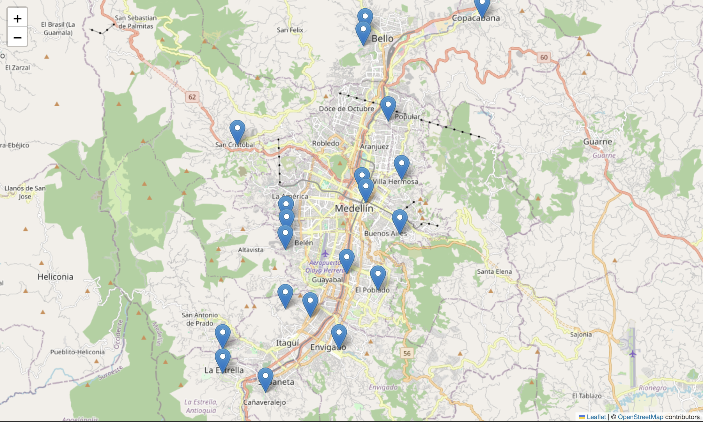
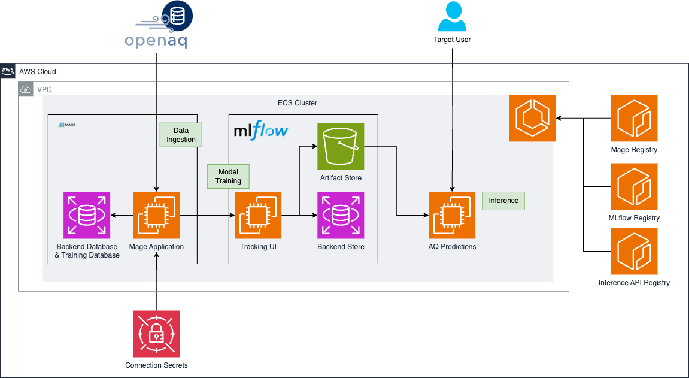

# Air Quality Prediction Model for Medellin, Colombia

## Overview

This project aims to develop a machine learning model that predicts air quality measurements for a specific sensor location in Medellin, Colombia. The model is designed to serve as a backup or replacement for the physical sensor, offering a cost-effective solution for continuous air quality monitoring.

This project can be run:

- [Locally via docker compose](/docs/HOW_TO.md)
- [Deploying the resources in AWS using Terraform](./docs/ARCHITECTURE.md).

## Objectives

1. **Data Collection**: Utilize air quality data from OpenAQ, specifically focusing on sensors located in Medellin.
2. **Exploratory Data Analysis (EDA)**: Analyze the collected data to understand the patterns and distributions of air quality indicators.
3. **Model Development**: Build a predictive model using data from nearby sensors to estimate the measurements for the target sensor location.
4. **Implementation**: Deploy the model as a service, providing real-time predictions to serve as a backup for the physical sensor.

## Data Source

The data is sourced from [OpenAQ](https://openaq.org/), which provides access to air quality data collected from sensors around the world. For this project, data from sensors in Medellin will be utilized.

## Methodology

1. **Data Preprocessing**: Cleaning and preparing the data for analysis.
2. **Feature Engineering**: Identifying and creating relevant features for the model.
3. **Model Training and Evaluation**: Training various machine learning models and evaluating their performance.
4. **Deployment**: Setting up the model for real-time prediction and integration with existing systems.

## Potential Impact

By providing accurate air quality predictions, this model can help local authorities and residents make informed decisions about environmental and public health. Additionally, it can serve as a cost-effective alternative for air quality monitoring in areas where deploying physical sensors is not feasible.

## Disclaimer

To run this project locally, you will need an OpenAQ API key. This key is necessary to access the OpenAQ data with a higher rate of data requests. The API key is free to obtain, and you can follow the instructions [here](https://docs.openaq.org/docs/getting-started) to get it.

Once you have the API key, please add it to your `local.env` file under the key `OPENAQ_API_KEY`.

## Repository Structure

- **`docs/`**  
  This directory contains markdown files that document how to use the repository effectively. It also includes detailed explanations of the MAGE pipelines and provides screenshots of the project to help users visualize the process and understand the workflow.

- **`notebooks/`**  
  This directory houses exploratory Jupyter notebooks that guide users through the project step by step in a local environment. These notebooks are essential for understanding the data, performing exploratory data analysis (EDA), and iteratively developing the project.

- **`mage/`**  
  The `mage` directory contains the code necessary to build the MAGE AI Docker image. It also includes the MAGE pipelines, which are responsible for handling data extraction, transformation, and model training processes within the project.

- **`mlflow/`**  
  This directory includes the code and configuration required to build the MLflow Docker image. MLflow is used in this project for model tracking, registration, and deployment, ensuring that the best-performing models are registered and available for inference.

- **`inference_api/`**  
  The `inference_api` directory contains the code and Dockerfiles needed to build the API based on FastAPI. This API serves predictions from the model registered in MLflow, providing endpoints for both single and batch predictions.

- **`infra/`**  
  This directory contains Terraform files that define the infrastructure as code (IaC) for the project. These files are used to build and manage the entire project infrastructure, ensuring that deployment is consistent, repeatable, and scalable.

- **`docker-compose.yaml`**  
  This file defines the local infrastructure of the project using Docker Compose. It sets up all the necessary services, including databases, the MLflow tracking server, and the API service, making it easy to run the project locally.

- **`local.env`**  
  The `local.env` file stores environment variables that are required to run the project locally. This includes sensitive information such as API keys and database passwords for local testing.

- **`Makefile`**  
  The Makefile provides shortcuts for common tasks such as testing, linting, and formatting code. It simplifies the workflow by allowing users to run complex commands with simple `make` commands.

- **`poetry.lock` and `pyproject.toml`**  
  These files manage the project's dependencies using Poetry. They ensure that all necessary packages are installed with the correct versions, maintaining consistency across development environments.

- **`README.md`**  
  The README file offers a high-level overview of the project, including instructions on how to set up and use the repository.

- **`requirements.txt`**  
  This file lists the Python dependencies required for the project. It is used to install the necessary packages when setting up the environment.

## How to Use

Instructions about running the project are found in `docs/`. You can start [here](./docs/HOW_TO.md).

## License

This project is licensed under the MIT License.
