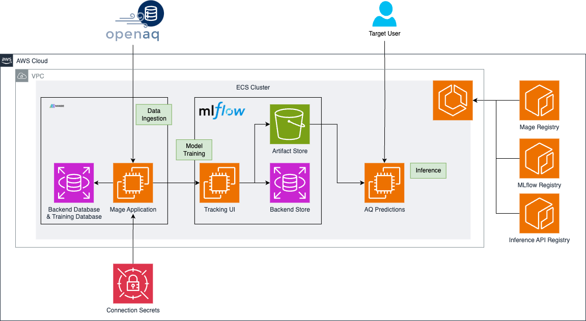

# Architecture Overview

This project architecture is designed to manage and process air quality data using a cloud-based infrastructure on AWS.

Below is a detailed breakdown of the architecture components:

## 1. Data Source - OpenAQ
- The architecture begins with fetching air quality data from the OpenAQ platform. This data is essential for training models and making predictions.

## 2. AWS ECS Cluster
- **ECS Cluster**: The ECS cluster is configured to run three main tasks:
  - **Mage Task**: This task runs MAGE AI, where machine learning models are trained. These models are logged to MLflow for version control and tracking.
  - **MLflow Task**: MLflow manages the lifecycle of machine learning models. It stores model artifacts in an S3 bucket and logs experiment data in an RDS instance.
  - **Inference API Task**: This task deploys a FastAPI-based API that fetches the trained model from MLflow and serves predictions.

## 3. S3 Bucket - Artifact Store
- The S3 bucket serves as the artifact store where MLflow saves the trained models. These models are then retrieved by the inference API for making predictions.

## 4. RDS Instances
- **MLflow RDS**: This RDS instance is used by MLflow to store experiment metadata and results.
- **Mage RDS**: This instance stores the training data and MAGE AI configuration tables.

## 5. Secrets Manager
- AWS Secrets Manager is used to securely store connection secrets, such as database credentials, which are required by the ECS tasks.

## 6. Target User
- The target user interacts with the system through the inference API, which provides air quality predictions based on the latest models trained and managed in this architecture.

## 7. GitHub Secrets
- The following secrets should be stored in GitHub to support the Terraform workflow and other aspects of the deployment:

  - `AWS_ACCESS_KEY_ID`
  - `AWS_SECRET_ACCESS_KEY`
  - `ECS_CLUSTER`
  - `MAGE_ECR_REPOSITORY`
  - `MAGE_ECS_SERVICE`
  - `MAGE_ECS_TASK_DEFINITION`
  - `MLFLOW_ECR_REPOSITORY`
  - `MLFLOW_ECS_SERVICE`
  - `MLFLOW_ECS_TASK_DEFINITION`
  - `TF_BACKEND_BUCKET`
  - `TF_BACKEND_KEY`
  - `TF_BACKEND_REGION`
  - `TF_VAR_API_HOST`
  - `TF_VAR_MAGEDB_HOST`
  - `TF_VAR_MAGEDB_NAME`
  - `TF_VAR_MAGEDB_PASSWORD`
  - `TF_VAR_MAGEDB_PORT`
  - `TF_VAR_MAGEDB_USER`
  - `TF_VAR_MAGE_DATABASE_CONNECTION_URL`
  - `TF_VAR_MAGE_RDS_PASSWORD`
  - `TF_VAR_MAGE_RDS_USERNAME`
  - `TF_VAR_MLFLOW_HOST`
  - `TF_VAR_MLFLOW_RDS_PASSWORD`
  - `TF_VAR_MLFLOW_RDS_USERNAME`
  - `TF_VAR_OPENAQ_API_KEY`
  - `TF_VAR_PROJECT_PREFIX`

We also use the `AWS_REGION`variable.

- **Note**: The `TF_VAR_*` secrets are used by Terraform in the workflow, which is stored in `.github/workflows/terraform.yml`.

---

