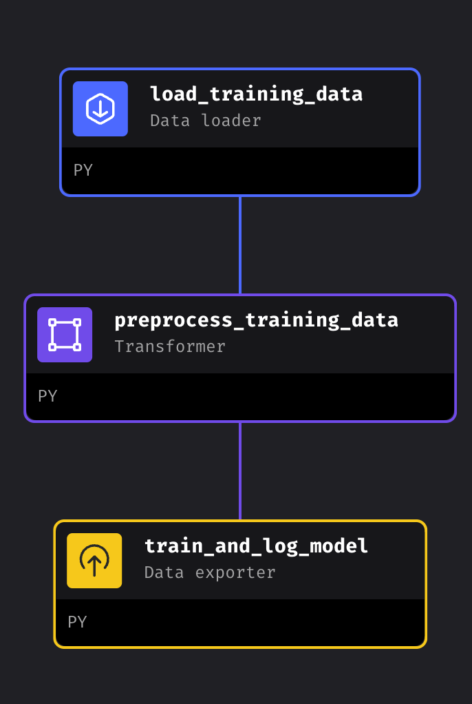

# Overview of MAGE Pipelines

This document provides an overview of the data extraction, training, and monitoring pipelines within the Mage AI environment, explaining their purpose and execution order.

### 1. `openaq_data_etl` Pipeline

**Purpose**: The `openaq_data_etl` pipeline is responsible for extracting, transforming, and loading (ETL) data from the OpenAQ platform. This involves gathering environmental data, processing it, and preparing it for subsequent steps.

**Key Steps**:
- **dynamic_sensor_definition**: Defines the dynamic sensor parameters.
- **load_openaq_data**: Loads data from the OpenAQ platform.
- **reduce_openaq_data**: Processes and reduces the data to a manageable format.
- **export_openaq_data**: Exports the processed data for further use.
- **trigger_model_training**: Prepares the data for model training and triggers the `model_training` pipeline.

### 2. `model_training` Pipeline

**Purpose**: The `model_training` pipeline trains machine learning models using the data processed by the `openaq_data_etl` pipeline. 

**Key Steps**:
- **load_training_data**: Loads the training data.
- **preprocess_training_data**: Prepares the data for model training by cleaning or transforming it.
- **train_and_log_model**: Trains the machine learning model and logs the results.

**Triggering**: The `model_training` pipeline can be triggered automatically by the `openaq_data_etl` pipeline. Additionally, it can be triggered by the `monitoring` pipeline, depending on the results from EvidentlyAI’s block.

### 3. `simulate_production_predictions` Pipeline

**IMPORTANT**: this pipeline requires a running docker container with your model. [This file](../inference_api/build.sh) sets up the docker container after you succesfully trained a model in pipeline # 2.

**Purpose**: The `simulate_production_predictions` pipeline simulates the production environment by generating predictions using the trained model.

**Key Steps**:
- **load_test_data**: Loads test or production data for prediction.
- **predict**: Runs the trained model to generate predictions.
- **export_predictions**: Exports the predictions for analysis or application use.

### 4. `monitoring` Pipeline

**Purpose**: The `monitoring` pipeline tracks the model’s performance and detects data drifts or other issues over time.

**Key Steps**:
- **load_reference_current**: Loads current reference data for comparison.
- **evidently_report**: Generates reports to identify data drifts or performance issues.
- **update_training_data**: Updates the training data if a drift is detected.
- **trigger_model_training**: Can trigger the `model_training` pipeline if significant drift or issues are identified.

### Execution Order

The following image shows the execution order of these pipelines within Mage AI:

.